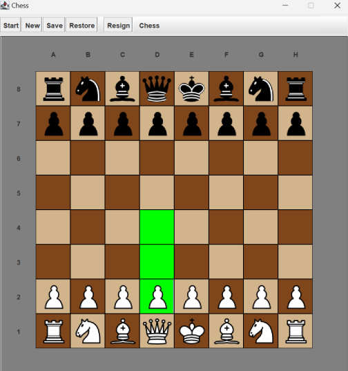

Chris Fernandes Chess Project (cpf44@cornell.edu)

Deployed at: https://chess-408713.ue.r.appspot.com/  
Starting FEN: rnbqkbnr/pppppppp/8/8/8/8/PPPPPPPP/RNBQKBNR w KQkq - 0 1

General Information:
-Goal: Implement a chess game with a GUI where players can play each other locally,
only making moves as enforced by the rules of chess. I focussed more on solid object-oriented design
rather than the efficiency and technical details of my implementations.

Features:
- All rules of piece movement are enforced, including but not limited to:  
--> Pieces that are under absolute pins cannot move    
--> Castling only when allowed  
--> En Passant only when allowed  
--> User can input a valid FEN and generate that boardstate  

Invariants:
-There must always be one of each king on the board to start a game.
-Assumes there are no checks when the game starts.

TODOs:
-Draws other than stalemates E.g. three-fold repetition or insufficient material.  
-Some kind of notification that a checkmate/stalemate has been reached.  
-Ability to export PGNs and FENs  
-General GUI improvements, e.g. listing pieces that have been captured.  
-Implement an AI opponent